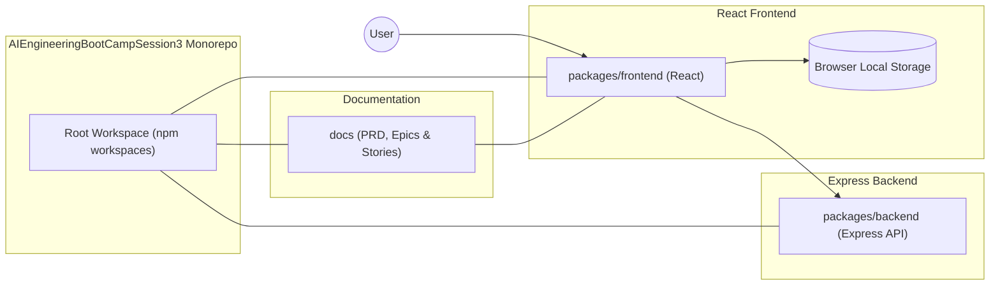
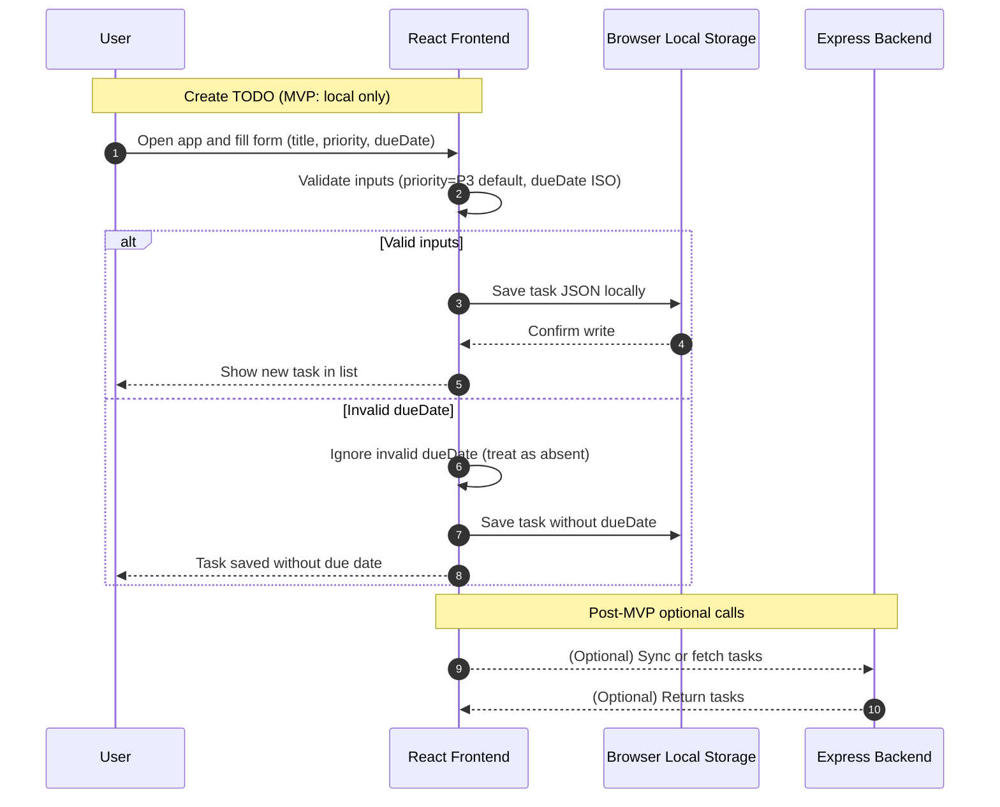

# Cloud/Monorepo System Context Diagram

```mermaid
flowchart LR
  subgraph Monorepo [AIEngineeringBootCampSession3 Monorepo]
    Repo["Root Workspace (npm workspaces)"]
  end

  subgraph Frontend [React Frontend]
    FE["packages/frontend (React)"]
    LocalStorage[("Browser Local Storage")]
  end

  subgraph Backend [Express Backend]
    BE["packages/backend (Express API)"]
  end

  subgraph Docs [Documentation]
    DocsPRD["docs (PRD, Epics & Stories)"]
  end

  User(("User"))

  User --> FE
  FE --> LocalStorage
  FE --> BE
  Repo --- FE
  Repo --- BE
  Repo --- DocsPRD
  DocsPRD --- FE
```

---

# Create TODO - Sequence Diagram

```mermaid
sequenceDiagram
  autonumber
  participant U as User
  participant FE as React Frontend
  participant LS as Browser Local Storage
  participant BE as Express Backend

  Note over U,FE: Create TODO (MVP: local only)
  U->>FE: Open app and fill form (title, priority, dueDate)
  FE->>FE: Validate inputs (priority=P3 default, dueDate ISO)
  alt Valid inputs
    FE->>LS: Save task JSON locally
    LS-->>FE: Confirm write
    FE-->>U: Show new task in list
  else Invalid dueDate
    FE->>FE: Ignore invalid dueDate (treat as absent)
    FE->>LS: Save task without dueDate
    FE-->>U: Task saved without due date
  end

  Note over FE,BE: Post-MVP optional calls
  FE-->>BE: (Optional) Sync or fetch tasks
  BE-->>FE: (Optional) Return tasks
```
